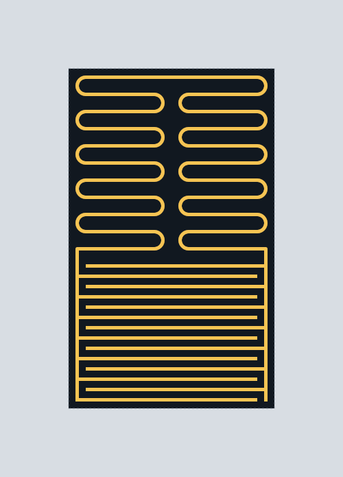

# Geerlings compact resonator: parametric layout and eigenfrequency

This repository reconstructs the compact resonator in Fig. 1 of Geerlings
*et al.*, *Applied Physics Letters* **100**, 192601 (2012), and provides a
reproducible path from parameterized layout to electromagnetic eigenfrequency.
The analyzed variant is an isolated aluminium resonator; the upper feedline and
all ports are omitted.

```text
TOML geometry -> GDS/SVG/STEP -> Gmsh tetrahedra -> NGSolve H(curl) PEC mode
                                                     |
                                                     v
                         low-temperature Al sheet kinetic inductance
                                                     |
                                                     v
                                  thickness-corrected resonance sweep
```



## Near-square 9 GHz variant

The adjusted isolated layout is configured in
[`configs/design_square_9ghz_al200.toml`](configs/design_square_9ghz_al200.toml)
with a 150 nm alternative in the adjacent config. The ground-cutout bounding
rectangle is **413 x 420 um** (aspect ratio 0.9833; side mismatch 1.67%). The
IDC retains 14 fingers while the meander is reduced from 10 to 7 turns.

The 5 um H(curl) PEC solve gives 9.098137 GHz. Applying the same documented
low-temperature Al kinetic-inductance correction gives **8.975563 GHz at
150 nm** and **8.993531 GHz at 200 nm**. Thus 200 nm is the primary 9 GHz
design point (-6.47 MHz, -0.072%); 150 nm remains within -24.44 MHz (-0.272%).
The preview, field plot, compact solver output, and thickness results are under
[`results/square_9ghz`](results/square_9ghz). Numerical mesh uncertainty remains
larger than these residual target errors, so more displayed digits are not a
fabrication-accuracy claim.

## Main result

The converged zero-thickness PEC baseline is **10.416985 GHz**. Applying the
documented reduced-order aluminium kinetic-inductance model gives:

| Al thickness | Sheet inductance | Kinetic-corrected frequency |
|---:|---:|---:|
| 100 nm | 116.694 fH/sq | 10.174467 GHz |
| 150 nm | 82.767 fH/sq | 10.243224 GHz |
| 200 nm | 70.422 fH/sq | 10.268590 GHz |

The nominal change from 100 to 200 nm is **+94.123 MHz**. The complete 10 nm
grid, uncertainty envelopes, plot, and machine-readable metadata are under
[`results/kinetic_inductance_sweep_100_200nm`](results/kinetic_inductance_sweep_100_200nm).

This is a frozen-current reduced-order correction of a full-wave PEC mode, not
a surface-impedance full-wave eigensolve. The distinction, equations, and
uncertainty semantics are recorded in
[`docs/kinetic_inductance_sweep.md`](docs/kinetic_inductance_sweep.md).

## Reproduce

Python 3.12--3.14 is supported. Install the layout and analysis dependencies:

```powershell
python -m venv .venv
.\.venv\Scripts\python.exe -m pip install -e ".[cad,mesh,analysis,dev]"
```

Generate the layout:

```powershell
.\.venv\Scripts\geerlings-em.exe build -c configs\design_a.toml --step
```

Run the kinetic-inductance sweep after a PEC baseline has been selected:

```powershell
$env:PYTHONPATH="$PWD\src"
.\.venv\Scripts\python.exe -B scripts\kinetic_inductance_sweep.py
```

The Windows-native Gmsh/NGSolve baseline command and convergence study are in
[`docs/ngsolve_result_design_a.md`](docs/ngsolve_result_design_a.md). Palace
input generation remains available, but Palace itself is supported on Linux;
the results committed here use NGSolve on Windows.

## Parameterization

Edit [`configs/design_a.toml`](configs/design_a.toml), or apply dotted command
line overrides, for example:

```powershell
.\.venv\Scripts\geerlings-em.exe build -c configs\design_a.toml `
  --set resonator.gC=20 --set resonator.gL=5 --set resonator.w=10
```

The paper specifies Design-A values `gC=10 um`, `gL=20 um`, `gR=10 um`,
`w=5 um`, and modal target `Z0=100 ohm`. Finger length, meander span length,
substrate dimensions, dielectric constant, and enclosure dimensions were not
reported and are explicit reconstruction assumptions. The visible defaults
use 14 IDC fingers and 21 horizontal inductor spans.

The original paper used 200 nm niobium. Aluminium, the 100--200 nm sweep, and
the material model are choices for this follow-up analysis.

## Artifacts

- `results/baseline_pec/`: compact PEC convergence data and selected field plot.
- `results/kinetic_inductance_sweep_100_200nm/`: CSV, JSON, and sweep plot.
- `build/`: regenerable raw solver output; excluded from Git history.
- GitHub Release `em-results-v1`: archived raw NGSolve meshes and VTU fields.
- `provenance/`: LLM-oriented context, event log, and SHA-256 manifest.

Run the tests with:

```powershell
$env:PYTHONPATH="$PWD\src"
.\.venv\Scripts\python.exe -B -m unittest discover -s tests -v
```

## Interpretation limits

- The geometry is reconstructed from a schematic, not from the original mask.
- The PEC frequency has a conservative `+/-0.10 GHz` mesh envelope.
- The modal impedance is the configured 100 ohm target, not a field-extracted
  impedance; its uncertainty is represented by an effective-squares envelope.
- The kinetic model assumes a 20 mK low-temperature aluminium film and the
  published thickness fit. Process-specific `Tc`, sheet resistance, or a
  measured penetration depth should replace it for fabrication prediction.
- Finite geometric metal thickness and conductor-loss Q are not solved here.

## References

- [Geerlings et al. (2012)](https://doi.org/10.1063/1.4710520)
- [López-Núñez et al. aluminium thin-film characterization (2025)](https://doi.org/10.1088/1361-6668/adf360)
- [setupEM](https://github.com/VolkerMuehlhaus/setupEM)
- [Palace](https://awslabs.github.io/palace/stable/)
- [gdsfactory](https://gdsfactory.github.io/gdsfactory/)
- [build123d](https://github.com/gumyr/build123d)
- [NGSolve Maxwell eigenproblem tutorial](https://docu.ngsolve.org/latest/i-tutorials/unit-2.4-Maxwell/Maxwellevp.html)
