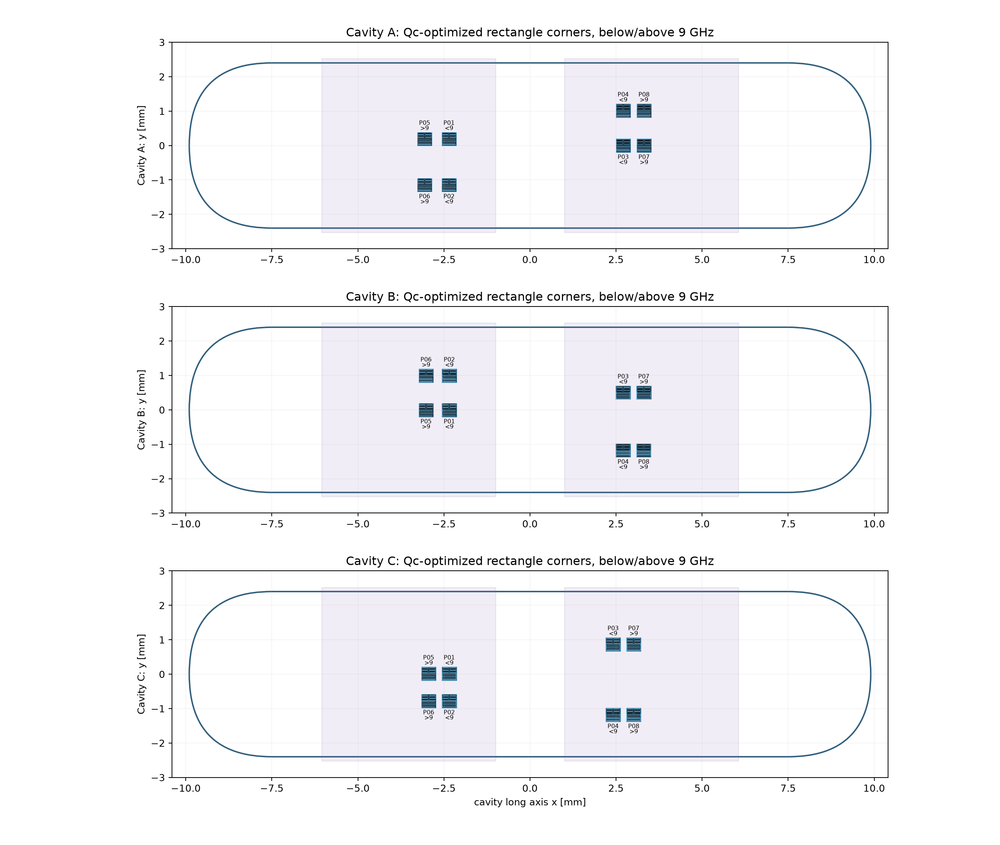
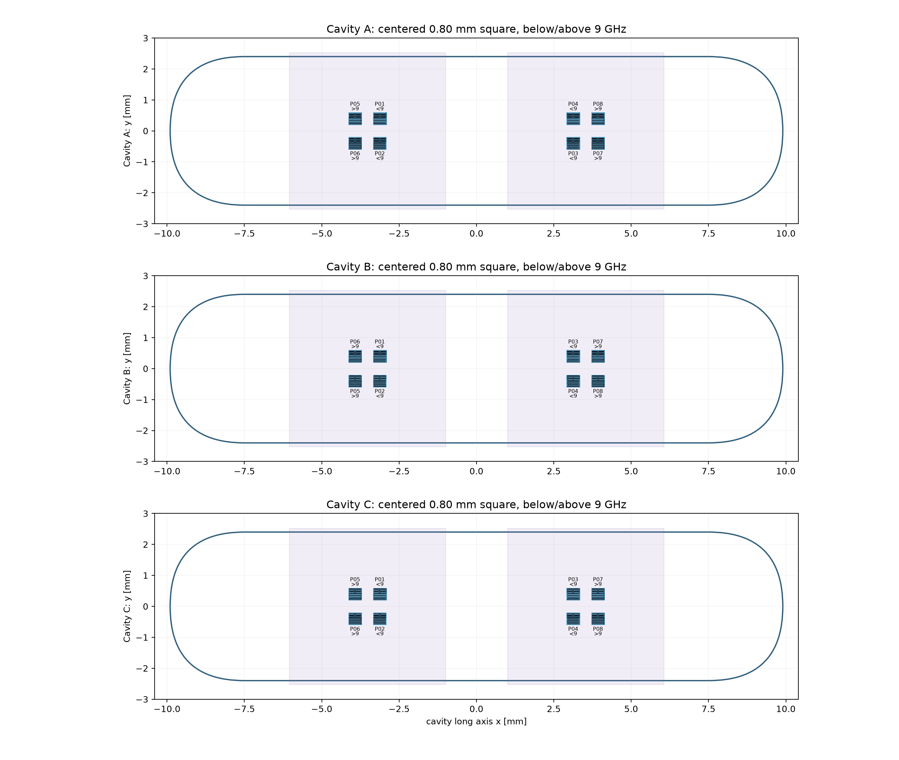

# Four-resonator rectangle chips with Qc equalization

## Result

Each 5.05 mm chip carries four unrotated Geerlings resonators whose centers are
the four corners of an axis-aligned rectangle.  The layout keeps two modes
below 9 GHz and two above 9 GHz on each chip.  This mixed assignment is
intentional: putting all four sub-9-GHz modes on one chip and all four
over-9-GHz modes on the other left at least about 3.3% Qc spread under the same
rectangle and non-overlap constraints.

At the nominal resonator external-Qc target of `1.0e6`, the optimized
reduced-order result is:

| Cavity | SMA pin length (mm) | Pin protrusion (mm) | Resonator Qc min | Resonator Qc max | max/min |
|---|---:|---:|---:|---:|---:|
| A | 8.463572 | 0.963572 | 999,494.8 | 1,000,397.9 | 1.000904 |
| B | 8.930918 | 1.430918 | 998,436.4 | 1,001,049.5 | 1.002617 |
| C (15.20 mm) | 9.563236 | 2.063236 | 987,839.2 | 1,011,936.0 | 1.024393 |

Cases A and B retain the **0.262%** global deterministic model spread.  The
added 15.20 mm case is **2.439%** by itself and sets the max/min ratio over all
24 generated placements to **1.024393**.  Its solution reaches the 0.600 mm
minimum center separation; removing the pattern-column restriction produced
the same optimum.  The conservative minimum edge gap between ground cutouts
remains 0.174032 mm.



## Centered-square companion version

A second fabrication set fixes every chip to a square centered at the chip
origin.  Its side is 0.80 mm, so the four chip-local centers are exactly
`(-0.40, -0.40)`, `(-0.40, +0.40)`, `(+0.40, -0.40)`, and
`(+0.40, +0.40)` mm.  Only the pattern-to-corner assignment is selected from
the 3-D field data.

| Cavity | SMA pin length (mm) | Resonator Qc min | Resonator Qc max | max/min |
|---|---:|---:|---:|---:|
| A | 8.4636 | 934,022.7 | 1,072,376.2 | 1.1481 |
| B | 8.9309 | 926,691.5 | 1,081,107.0 | 1.1666 |
| C (15.20 mm) | 9.5642 | 926,086.8 | 1,079,861.8 | 1.1660 |

The centered-square global max/min ratio is **1.167393**.  This larger 16.7%
spread is the direct tradeoff for fixing all four rectangles to the chip
center instead of allowing the Qc optimizer to move them.  Its minimum
ground-cutout gap is 0.374032 mm.



The six companion GDS files contain `centered_square` in their names, for
example
`cavity_A_left_centered_square_below9_P01-P02_above9_P05-P06_4res.gds`.
The associated CSV, JSON, preview, manifest, and readback files use the same
`centered_square_` prefix in `results/four_resonator_chip/`.

## Optimized rectangle coordinates

Coordinates are relative to each chip center.  Every chip uses exactly the
Cartesian product `{x_low, x_high} x {y_low, y_high}`.

| Cavity/chip | x low (mm) | x high (mm) | y low (mm) | y high (mm) |
|---|---:|---:|---:|---:|
| A / left | 0.462089 | 1.170965 | -1.144980 | 0.190405 |
| A / right | -0.818393 | -0.213233 | -0.001215 | 1.015194 |
| B / left | 0.503932 | 1.180000 | -0.003953 | 0.993915 |
| B / right | -0.819876 | -0.219876 | -1.176560 | 0.502291 |
| C / left | 0.579176 | 1.179219 | -0.777434 | 0.015693 |
| C / right | -1.111399 | -0.511191 | -1.179140 | 0.866611 |

The low-frequency P01--P04 patterns occupy the stronger inner columns and the
high-frequency P05--P08 patterns occupy the weaker outer columns.  The
optimizer also chooses the upper/lower assignment in each column.

## GDS outputs and naming

The optimized-rectangle filenames and GDS text labels explicitly distinguish
modes below and above 9 GHz:

- `cavity_A_left_below9_P01-P02_above9_P05-P06_4res.gds`
- `cavity_A_right_below9_P03-P04_above9_P07-P08_4res.gds`
- `cavity_B_left_below9_P01-P02_above9_P05-P06_4res.gds`
- `cavity_B_right_below9_P03-P04_above9_P07-P08_4res.gds`
- `cavity_C_left_below9_P01-P02_above9_P05-P06_4res.gds`
- `cavity_C_right_below9_P03-P04_above9_P07-P08_4res.gds`

Layer 1/0 is positive aluminium metal, 100/0 is the 5.05 mm chip outline, and
101/0 contains labels such as `P01_BELOW9_ROT0` and `P05_ABOVE9_ROT0`.  All
six GDS files were read back with KLayout; each has one top cell, one outline,
four labels, and more than 1,000 metal shapes.

## Electromagnetic calculation and Qc semantics

The position response comes from a current-geometry, silicon-loaded, closed-PEC
3-D NGSolve H(curl) eigenmode calculation.  The sampled in-plane electric
field is interpolated in both chip-local x and y.

| Case | Cavity height (mm) | Closed-cavity mode (GHz) | Tetrahedra | H(curl) DOF | last eigenvalue change |
|---|---:|---:|---:|---:|---:|
| A | 18.00 | 9.759925 | 68,506 | 166,858 | 1.81e-4 |
| B | 17.77 | 9.797195 | 65,689 | 160,022 | 3.34e-4 |
| C | 15.20 | 10.328000 | 49,822 | 122,416 | 5.04e-6 |

The absolute resonator Qc is a hybrid calibration, not a conformal
micron-to-centimeter full-wave solution.  Historical direct 3-D FEM pin/Qc
anchors are frequency-aligned to the current closed-cavity solves, then
converted with

`Qc_res = fr * Qc_cavity * (fc - fr)^2 / (fc * g^2)`.

The nominal mean coupling is `g/2pi = 25 MHz`; absolute Qc scales as `1/g^2`.
The robust output is the relative position equalization.  The current field
solve does not include the SMA bore or pin, and the current
18.00/17.77/15.20 mm geometries have not received a new direct port-inclusive
pin sweep.  Case C explicitly uses the historical case-B pin-Qc curve as a
proxy, frequency-aligned to the current 15.20 mm closed-cavity solve.
Measurement or a conformal port-inclusive model is required before fabrication
sign-off.

## Reproduce

Generate the current-depth field calibration (requires NGSolve):

```powershell
$env:PYTHONPATH="$PWD\src"
python -B scripts\simulate_current_cavity_fields.py --maxh 0.9 --chip-maxh 0.20 --iterations 40
```

Optimize the rectangles and regenerate GDS/CSV/JSON/previews:

```powershell
$env:PYTHONPATH="$PWD\src"
python -B scripts\generate_four_resonator_chip.py
```

Machine-readable coordinates, Qc values, provenance, sensitivity envelopes,
and GDS readback are under `results/four_resonator_chip/`.
